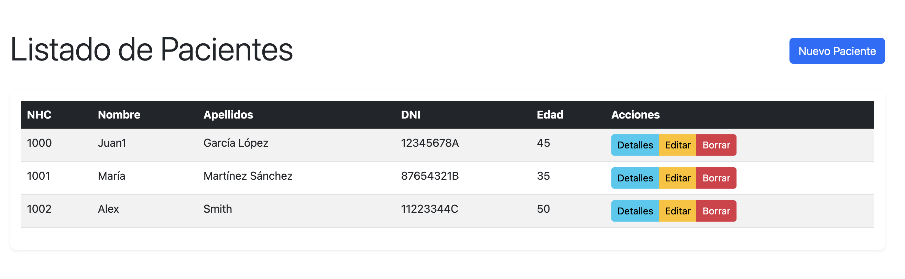
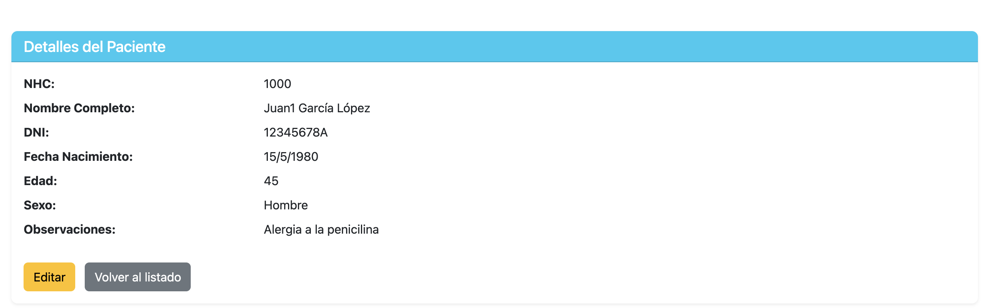

# Sistema de Gestión Hospitalaria

Aplicación web para gestión de pacientes desarrollada con:
- ASP.NET Core MVC
- Entity Framework Core
- SQL Server
- Arquitectura Onion

## Características Principales
- CRUD completo de pacientes
- Validación de datos
- Diseño responsive con Bootstrap
- Inyección de dependencias

## Requisitos
- .NET 7.0 SDK
- SQL Server
- Visual Studio 2022 o VS Code

## Configuración
1. Clonar repositorio
2. Configurar cadena de conexión en `appsettings.json`
3. Ejecutar migraciones

```bash
dotnet ef database update
```

## Capturas de Pantalla

### Listado de Pacientes


### Detalles de Paciente


## Licencia
MIT
